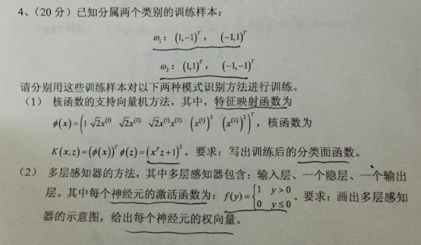

SVM的原理不太记得了，今天来复习一遍，题目如下

 
图1. 题目

设feature为$underline{x_{i}}$，label为$ y_{i}\in {-1,1} $[*1]

通过\\(\phi(\underline{x})\\)映射后的特征线性可分，所以我们可以使用hard-margin SVM去分类。

设 discriminant function 为 $ f(x)=\underline{\omega}^{T}\phi(\underline{x})+b $ Decision Boundary 为$ \underline{\omega}^{T}\phi(\underline{x})+b=0 $

SVM原则是 maximize margin  [*2] ，即 $$ \underset{\underline{\omega}}{max}(\frac{2}{\left \| \underline{\omega} \right \|^{2}}) s.t.  y_{i}(\underline{\omega}^{T}\phi(\underline{x})+b)\geqslant 1,i=1,2,...,m$$

等同于 $$\underset{\underline{\omega}}{min}(\frac{1}{2}{\left \| \underline{\omega} \right \|^{2}}) s.t. y_{i}(\underline{\omega}^{T}\phi(\underline{x})+b)\geqslant 1,i=1,2,...,m$$

这是个凸二次规化问题 a (linearly constrained) quadratic optimization problem (Quadratic Programming)[https://en.wikipedia.org/wiki/Quadratic_programming]. 可以转化为 dual problem 解决 [*3].

构建其 Lagrange function $$ L(\underline{\alpha},\underline{\omega},b )=\frac{1}{2}{\left \| \underline{\omega} \right \|^{2}}+\sum_{i=1}^{m}\alpha _{i}[1-y_{i}(\underline{\omega}^{T}\phi(\underline{x_{i}})+b)] $$

原问题 (primal problem) [*4] 为$$ \underset{\underline{\omega},b}{min}\underset{\alpha _{i}\geq 0}{max}L(\underline{\alpha},\underline{\omega},b) $$

其 dual function 为 $ \underset{\underline{\omega},b}{min}(L(\underline{\alpha},\underline{\omega},b)) $

dual problem 为 $ \underset{\alpha _{i}\geq 0}{max}\underset{\underline{\omega},b}{min}(L(\underline{\alpha},\underline{\omega},b)) $

primal problem 与 dual problem 相等时叫 strong duality [*5]，我们假设hard-margin SVM中 strong duality 存在 [*6]

KKT条件是 strong duality 的必要条件 [*6]。对于凸函数(convex problem),KKT条件也是 strong duality 的充分条件 [*7]。

令$ \frac{\partial L}{\partial \underline{\omega }}=0 $ 与 $ \frac{\partial L}{\partial b}=0 $, 解得的值带入dual function

dual problem 变为$$ \underset{\underline{\alpha}}{max}(\underline{\alpha}\underline{\underline{Q}}\underline{\alpha}) $$

其中$$ \underline{\underline{Q}}=[y_{1}\phi(\underline{x_{1}}),y_{2}\phi(\underline{x_{2}}),y_{3}\phi(\underline{x_{3}}),y_{4}\phi(\underline{x_{4}})]^{T}[y_{1}\phi(\underline{x_{1}}),y_{2}\phi(\underline{x_{2}}),y_{3}\phi(\underline{x_{3}}),y_{4}\phi(\underline{x_{4}})] $$

dual problem 等效于

[*1]: label取${-1,+1}$是为了简化计算，也可以取其他的数作为label

[*2]: 为什么 margin=$ \frac{2}{\left \| \underline{\omega} \right \|^{2}} $

[*3]: duality参见(Duality(optimization))[https://en.wikipedia.org/wiki/Duality_(optimization)], 

For convex optimization problems, under a constraint qualification condition, the duality gap (the difference between the primal and dual solutions) is zero, which is also called strong duality.  

[*4]: 任何一个约束条件不满足，都会导致$ \underset{\alpha _{i}\geq 0}{max}L(\underline{\alpha},\underline{\omega},b)\rightarrow +\infty $，
从而无法$ \underset{\underline{\omega},b}{min}(\underset{\alpha _{i}\geq 0}{max}L(\underline{\alpha},\underline{\omega},b)) $

[*5]: 

[*6]: 当满足one of constraint qualifications (like Slater condition) 时表示 strong duality 存在。这里只是指出了 strong duality 成立的一种情况，而并不是唯一情况。
Slater 条件实际上在这里就等价于是存在这样的一个超平面将数据分隔开来，亦即是“数据是可分的”。当数据不可分是，strong duality 不能成立。见(http://blog.pluskid.org/?p=702)[http://blog.pluskid.org/?p=702]

第二问中的感知机，不以max-margin为准则。所以可能的结构为，对应的权重为

